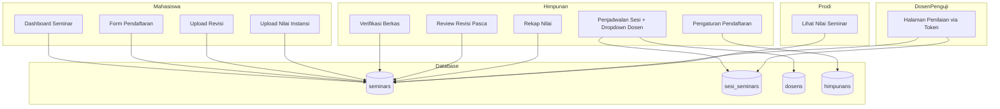

# Design Document: Seminar KP

## Overview

Fitur Seminar KP mengelola seluruh alur seminar Kerja Praktik di ekapta12. Sistem ini mengintegrasikan model Seminar yang sudah ada dengan penambahan fitur penjadwalan sesi, penilaian via link tanpa login, dan perhitungan nilai akhir otomatis.

Fitur utama:
- Pembukaan/penutupan pendaftaran oleh Himpunan
- Formulir pendaftaran dengan upload dokumen oleh Mahasiswa
- Verifikasi berkas dan revisi oleh Himpunan
- Penjadwalan sesi seminar dengan token penilaian unik
- Penilaian multi-mahasiswa oleh Dosen Penguji tanpa login
- Revisi pasca seminar dan upload nilai instansi
- Perhitungan nilai akhir otomatis

## Architecture



## Components and Interfaces

### Controllers

#### 1. HimpunanSeminarController
Mengelola fitur seminar dari sisi Himpunan.

```php
class HimpunanSeminarController extends Controller
{
    // Pengaturan pendaftaran
    public function pengaturan(): View
    public function togglePendaftaran(Request $request): RedirectResponse
    
    // Verifikasi berkas
    public function daftarPendaftar(): View
    public function verifikasi(Seminar $seminar): View
    public function prosesVerifikasi(Request $request, Seminar $seminar): RedirectResponse
    
    // Penjadwalan
    public function daftarSesi(): View
    public function createSesi(): View  // Form dengan dropdown dosen penguji dari tabel dosens
    public function storeSesi(Request $request): RedirectResponse
    public function editSesi(SesiSeminar $sesi): View
    public function updateSesi(Request $request, SesiSeminar $sesi): RedirectResponse
    public function assignMahasiswa(Request $request, SesiSeminar $sesi): RedirectResponse
    public function getDosenList(): Collection  // Get list dosen untuk dropdown
    
    // Review revisi pasca seminar
    public function daftarRevisiPasca(): View
    public function reviewRevisi(Seminar $seminar): View
    public function prosesRevisi(Request $request, Seminar $seminar): RedirectResponse
    
    // Rekap nilai
    public function rekapNilai(): View
}
```

#### 2. MahasiswaSeminarController
Mengelola fitur seminar dari sisi Mahasiswa.

```php
class MahasiswaSeminarController extends Controller
{
    public function index(): View  // Dashboard seminar
    public function create(): View  // Form pendaftaran
    public function store(Request $request): RedirectResponse  // Submit pendaftaran
    public function uploadRevisi(Request $request): RedirectResponse  // Upload revisi pasca
    public function uploadNilaiInstansi(Request $request): RedirectResponse  // Upload nilai instansi
}
```

#### 3. SeminarPenilaianController
Mengelola penilaian seminar via token (tanpa auth).

```php
class SeminarPenilaianController extends Controller
{
    public function index(string $token): View  // Halaman penilaian
    public function submit(Request $request, string $token): RedirectResponse  // Submit nilai
}
```

#### 4. ProdiSeminarController
Mengelola view nilai seminar untuk Prodi.

```php
class ProdiSeminarController extends Controller
{
    public function nilaiSeminar(): View
}
```

### Services

#### SeminarService
Business logic untuk seminar.

```php
class SeminarService
{
    public function isPendaftaranOpen(): bool
    public function validateRegistration(array $data): array
    public function createRegistration(Mahasiswa $mahasiswa, array $data): Seminar
    public function updateStatus(Seminar $seminar, string $status, ?string $catatan = null): void
    public function assignToSesi(Seminar $seminar, SesiSeminar $sesi, int $urutan): void
    public function submitGrades(SesiSeminar $sesi, array $grades): void
    public function calculateNilaiAkhir(Seminar $seminar): float
    public function updateNilaiAkhir(Seminar $seminar): void
}
```

## Data Models

### Seminar (Updated)
```php
// Existing fields + new fields
protected $fillable = [
    'pengajuan_id',
    'mahasiswa_id',
    'no_wa',                    // Nomor WA aktif
    'judul_laporan',            // Judul laporan
    'file_laporan',             // File laporan PDF
    'file_pengesahan',          // Lembar pengesahan PDF
    'lampiran_1',               // Sertifikat 1
    'lampiran_2',               // Sertifikat 2
    'lampiran_3',               // Sertifikat 3
    'lampiran_4',               // Sertifikat 4
    'jumlah_bayar',             // Nominal pembayaran (25000)
    'metode_bayar',             // Cash, DANA, SeaBank
    'bukti_bayar',              // Bukti pembayaran
    'status_seminar',           // Status alur seminar
    'sesi_seminar_id',          // FK ke sesi_seminars
    'urutan_presentasi',        // Urutan dalam sesi
    'nilai_seminar',            // Nilai dari penguji
    'catatan_himpunan',         // Catatan verifikasi dari Himpunan
    'catatan_penguji',          // Catatan dari penguji
    'file_laporan_revisi',      // Laporan revisi pasca seminar
    'bukti_perbaikan',          // Bukti perbaikan
    'nilai_instansi',           // Nilai dari instansi
    'file_nilai_instansi',      // File nilai instansi
    'nilai_akhir',              // Nilai akhir (calculated)
];

// Status constants
const STATUS_MENUNGGU_VERIFIKASI = 'menunggu_verifikasi';
const STATUS_DITERIMA = 'diterima';
const STATUS_REVISI = 'revisi';
const STATUS_DITOLAK = 'ditolak';
const STATUS_DIJADWALKAN = 'dijadwalkan';
const STATUS_SELESAI_SEMINAR = 'selesai_seminar';
const STATUS_REVISI_PASCA = 'revisi_pasca';
const STATUS_REVISI_DISETUJUI = 'revisi_disetujui';
const STATUS_SELESAI = 'selesai';
```

### SesiSeminar
```php
protected $fillable = [
    'tanggal',
    'jam_mulai',
    'jam_selesai',
    'tempat',                   // Ruangan atau link online
    'jumlah_mahasiswa',         // Max mahasiswa per sesi
    'token_penilaian',          // UUID untuk link penilaian
    'is_token_used',            // Token sudah dipakai
    'token_used_at',            // Waktu token dipakai
    'dosen_penguji_id',         // FK ke dosens (dropdown pilihan)
    'catatan_teknis',           // Catatan untuk penguji
];

// Relationship
public function dosenPenguji()
{
    return $this->belongsTo(Dosen::class, 'dosen_penguji_id');
}
```

### Himpunan (Updated)
```php
protected $fillable = [
    'nama',
    'username',
    'email',
    'password',
    'is_pendaftaran_seminar_open',  // Boolean untuk buka/tutup pendaftaran
];
```

### Dosen (Existing - untuk dropdown penguji)
```php
// Digunakan untuk dropdown pemilihan dosen penguji di form penjadwalan
// Query: Dosen::all() atau Dosen::where('is_active', true)->get()
```

### Database Schema Updates

```sql
-- Update himpunans table
ALTER TABLE himpunans ADD COLUMN is_pendaftaran_seminar_open BOOLEAN DEFAULT FALSE;

-- sesi_seminars table (already exists from migration)
-- seminars table updates (already exists from migration)

-- Add catatan fields to seminars if not exists
ALTER TABLE seminars ADD COLUMN catatan_himpunan TEXT NULL;  -- Catatan verifikasi dari Himpunan
ALTER TABLE seminars ADD COLUMN catatan_penguji TEXT NULL;   -- Catatan dari dosen penguji
```

## Correctness Properties

*A property is a characteristic or behavior that should hold true across all valid executions of a system-essentially, a formal statement about what the system should do. Properties serve as the bridge between human-readable specifications and machine-verifiable correctness guarantees.*

### Property 1: Pendaftaran Toggle Consistency
*For any* Himpunan action to open or close pendaftaran, the resulting state should match the action taken (open action → open state, close action → closed state)
**Validates: Requirements 1.1, 1.2**

### Property 2: Registration Validation Completeness
*For any* registration submission with missing required fields (nama, NIM, no_wa, judul_laporan, file_laporan, file_pengesahan, sertifikat 1-4, metode_bayar, bukti_bayar), the system should reject the submission with appropriate validation errors
**Validates: Requirements 2.1, 2.2, 2.3, 2.4, 2.5**

### Property 3: File Size Validation
*For any* uploaded file exceeding 10 MB, the system should reject the upload with size error
**Validates: Requirements 2.2, 2.3, 2.4, 2.5**

### Property 4: Registration Status Initialization
*For any* valid registration submission, the resulting seminar record should have status_seminar set to "menunggu_verifikasi"
**Validates: Requirements 2.6**

### Property 5: Verification Status Transition
*For any* verification action by Himpunan, the mahasiswa status_seminar should transition correctly: "Diterima" → "diterima", "Revisi" → "revisi", "Ditolak" → "ditolak"
**Validates: Requirements 3.3, 3.4, 3.5**

### Property 6: Revisi Catatan Storage
*For any* verification with status "Revisi", the catatan_himpunan field should be saved with the provided catatan
**Validates: Requirements 3.4**

### Property 7: Resubmission Status Reset
*For any* mahasiswa with status "revisi" who resubmits, the status should change to "menunggu_verifikasi"
**Validates: Requirements 3.7**

### Property 8: Sesi Token Uniqueness
*For any* created sesi seminar, the generated token_penilaian should be unique across all sesi records
**Validates: Requirements 4.2**

### Property 9: Sesi Assignment Status Update
*For any* mahasiswa assigned to a sesi, the status_seminar should be "dijadwalkan" and sesi_seminar_id should be set
**Validates: Requirements 4.4**

### Property 10: Token Link Format
*For any* sesi seminar, the generated link should follow format "/penilaian-seminar/{token_penilaian}"
**Validates: Requirements 4.5**

### Property 11: Invalid Token Rejection
*For any* token that is used (is_token_used = true) or expired, accessing the penilaian page should return error message
**Validates: Requirements 5.6**

### Property 12: Incomplete Grades Rejection
*For any* grade submission where at least one mahasiswa in the sesi is not graded, the submission should be rejected
**Validates: Requirements 5.3**

### Property 13: Grade Submission Persistence
*For any* complete grade submission, all mahasiswa in the sesi should have their nilai_seminar and catatan_penguji saved
**Validates: Requirements 5.4**

### Property 14: Token Invalidation After Submission
*For any* successful grade submission, the sesi token should be invalidated (is_token_used = true, token_used_at = current time)
**Validates: Requirements 5.5**

### Property 15: Grade Status Transition
*For any* graded mahasiswa, status_seminar should be "selesai_seminar" if grade status is "Diterima", or "revisi_pasca" if grade status is "Revisi"
**Validates: Requirements 5.7, 5.8**

### Property 16: Revisi Pasca Approval Transition
*For any* revisi pasca approval by Himpunan, mahasiswa status_seminar should change to "revisi_disetujui"
**Validates: Requirements 6.3**

### Property 17: Nilai Akhir Calculation
*For any* seminar with both nilai_seminar and nilai_instansi set, nilai_akhir should equal (nilai_seminar * 0.6) + (nilai_instansi * 0.4)
**Validates: Requirements 7.1**

### Property 18: Final Status Transition
*For any* seminar with nilai_akhir calculated and all requirements completed, status_seminar should be "selesai"
**Validates: Requirements 7.3**

### Property 19: Status Label Mapping
*For any* status_seminar value, the displayed label should match the predefined mapping (menunggu_verifikasi → "Menunggu Verifikasi", etc.)
**Validates: Requirements 8.1**

## Error Handling

### Validation Errors
- Missing required fields: Return specific field errors
- File size exceeded: Return "File tidak boleh lebih dari 10 MB"
- Invalid file type: Return "File harus berformat PDF"
- Invalid payment method: Return "Metode pembayaran tidak valid"

### Token Errors
- Invalid token: Display "Link penilaian tidak valid atau sudah digunakan"
- Expired token: Display "Link penilaian sudah kadaluarsa"
- Used token: Display "Link penilaian sudah digunakan"

### State Errors
- Pendaftaran closed: Display "Pendaftaran Seminar KP belum dibuka"
- Invalid status transition: Log error and maintain current state

## Testing Strategy

### Property-Based Testing Library
Menggunakan **PHPUnit** dengan **Faker** untuk generate random test data. Untuk property-based testing yang lebih advanced, dapat menggunakan **Eris** (PHP property-based testing library).

### Unit Tests
- Test validation functions for registration form
- Test status transition logic
- Test nilai calculation formula
- Test token generation uniqueness

### Property-Based Tests
Setiap correctness property akan diimplementasikan sebagai property-based test dengan format:
```php
/**
 * **Feature: seminar-kp, Property {number}: {property_text}**
 * **Validates: Requirements X.Y**
 */
public function test_property_name()
```

Property tests akan menggunakan random data generation untuk:
- Random mahasiswa data
- Random file sizes (valid and invalid)
- Random status values
- Random nilai values (0-100)

### Integration Tests
- Test complete registration flow
- Test complete grading flow via token
- Test complete revisi flow
